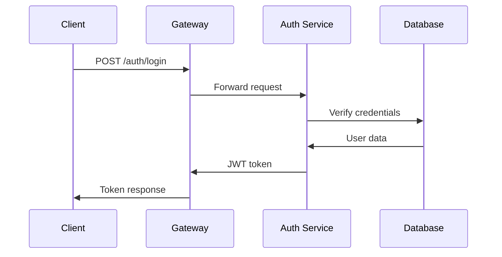
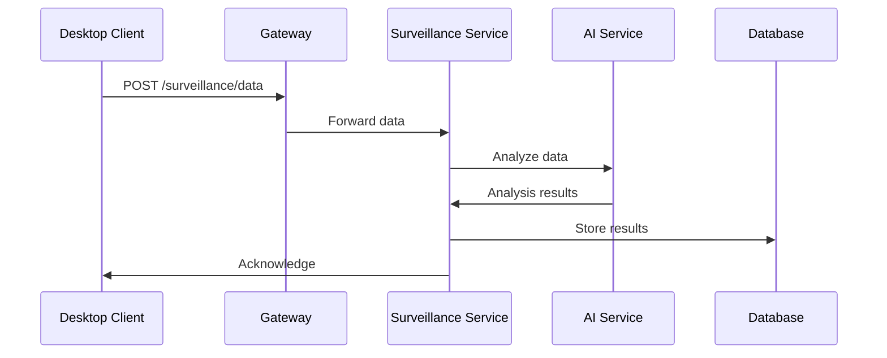
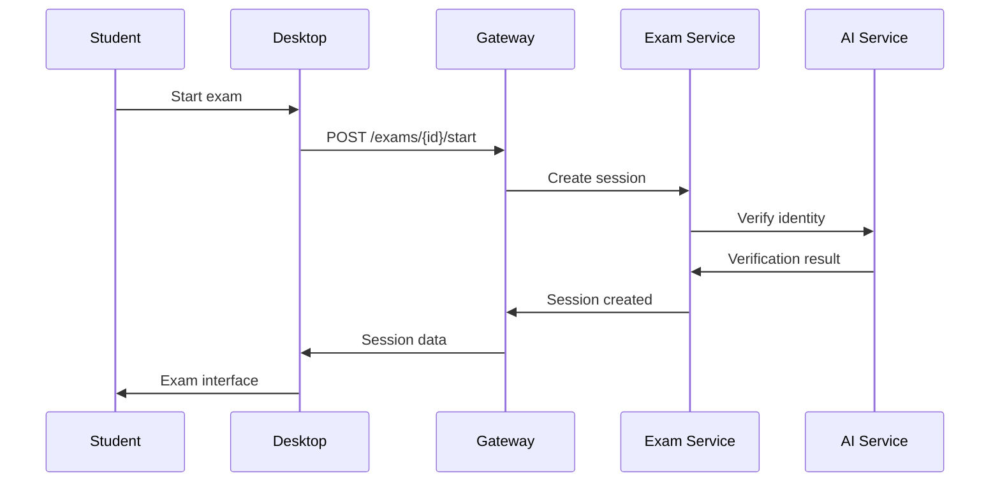

# Architecture Technique - ProctoFlex AI

## Table des matières
1. [Vue d'Ensemble](#vue-densemble)
2. [Architecture Système](#architecture-système)
3. [Composants Principaux](#composants-principaux)
4. [Flux de Données](#flux-de-données)
5. [Sécurité](#sécurité)
6. [Performance](#performance)
7. [Déploiement](#déploiement)
8. [Monitoring](#monitoring)

## 1. Vue d'Ensemble

ProctoFlex AI est une plateforme de surveillance intelligente pour examens en ligne, conçue avec une architecture microservices moderne et des technologies de pointe en intelligence artificielle.

### 1.1 Principes Architecturaux

- **Séparation des responsabilités** : Chaque composant a un rôle spécifique
- **Scalabilité horizontale** : Capacité d'extension selon la charge
- **Résilience** : Gestion des pannes et récupération automatique
- **Sécurité par défaut** : Chiffrement et authentification omniprésents
- **Observabilité** : Monitoring et logging complets

### 1.2 Stack Technologique

```
Frontend Admin    : React.js + TypeScript + Tailwind CSS
Client Desktop    : Electron + React + TypeScript
Backend API       : FastAPI + Python 3.9+
Base de Données   : PostgreSQL + Redis
IA/ML             : OpenCV + MediaPipe + TensorFlow
Infrastructure    : Docker + Kubernetes
Monitoring        : Prometheus + Grafana
```

## 2. Architecture Système

### 2.1 Diagramme d'Architecture

```
┌─────────────────┐    ┌─────────────────┐    ┌─────────────────┐
│   Frontend      │    │   Client        │    │   Mobile        │
│   Admin         │    │   Desktop       │    │   App           │
│   (React)       │    │   (Electron)    │    │   (React Native)│
└─────────┬───────┘    └─────────┬───────┘    └─────────┬───────┘
          │                      │                      │
          └──────────────────────┼──────────────────────┘
                                 │
                    ┌─────────────┴─────────────┐
                    │                           │
            ┌───────▼────────┐        ┌────────▼───────┐
            │   API Gateway  │        │   Load         │
            │   (Nginx)      │        │   Balancer     │
            └───────┬────────┘        └────────┬───────┘
                    │                          │
        ┌───────────┴───────────┐    ┌────────▼───────┐
        │                       │    │                │
┌───────▼────────┐    ┌────────▼───────┐    ┌────────▼───────┐
│   Auth         │    │   Exam         │    │   Surveillance │
│   Service      │    │   Service      │    │   Service      │
└───────┬────────┘    └────────┬───────┘    └────────┬───────┘
        │                      │                      │
        └──────────────────────┼──────────────────────┘
                               │
                    ┌───────────┴───────────┐
                    │                       │
            ┌───────▼────────┐    ┌────────▼───────┐
            │   AI/ML        │    │   File         │
            │   Service      │    │   Storage      │
            └───────┬────────┘    └────────┬───────┘
                    │                      │
        ┌───────────┴───────────┐    ┌────▼─────────────┐
        │                       │    │                  │
┌───────▼────────┐    ┌────────▼───────┐    ┌────────▼───────┐
│   PostgreSQL   │    │   Redis        │    │   MinIO        │
│   (Primary)    │    │   (Cache)      │    │   (Files)      │
└────────────────┘    └────────────────┘    └────────────────┘
```

### 2.2 Composants de l'Infrastructure

#### 2.2.1 API Gateway
- **Technologie** : Nginx + OpenResty
- **Fonction** : Routage, authentification, rate limiting
- **Configuration** : SSL/TLS, compression, caching

#### 2.2.2 Load Balancer
- **Technologie** : HAProxy
- **Fonction** : Distribution de charge, health checks
- **Algorithme** : Round-robin avec pondération

#### 2.2.3 Service Discovery
- **Technologie** : Consul
- **Fonction** : Découverte automatique des services
- **Configuration** : Health checks, métadonnées

## 3. Composants Principaux

### 3.1 Frontend Admin (React.js)

#### 3.1.1 Architecture Frontend

```
src/
├── components/          # Composants réutilisables
│   ├── Layout/         # Layout principal
│   ├── Dashboard/      # Tableau de bord
│   ├── Exams/          # Gestion des examens
│   ├── Users/          # Gestion des utilisateurs
│   └── Surveillance/   # Monitoring en temps réel
├── hooks/              # Hooks personnalisés
├── services/           # Services API
├── stores/             # État global (Zustand)
├── types/              # Types TypeScript
└── utils/              # Utilitaires
```

#### 3.1.2 Technologies Utilisées

- **React 18** : Framework principal
- **TypeScript** : Typage statique
- **Tailwind CSS** : Framework CSS utilitaire
- **React Query** : Gestion des données serveur
- **Zustand** : État global
- **React Hook Form** : Gestion des formulaires
- **Recharts** : Visualisation de données

### 3.2 Client Desktop (Electron)

#### 3.2.1 Architecture Electron

```
desktop/
├── main/               # Processus principal
│   ├── main.ts        # Point d'entrée
│   ├── preload.js     # Script de préchargement
│   └── ipc/           # Communication IPC
├── renderer/          # Processus de rendu
│   ├── components/    # Composants React
│   ├── services/      # Services locaux
│   └── utils/         # Utilitaires
└── shared/            # Code partagé
```

#### 3.2.2 Fonctionnalités Clés

- **Surveillance système** : Monitoring des processus
- **Capture d'écran** : Enregistrement continu
- **Verrouillage d'applications** : Contrôle d'accès
- **Communication sécurisée** : IPC avec chiffrement

### 3.3 Backend API (FastAPI)

#### 3.3.1 Architecture Backend

```
backend/
├── app/
│   ├── api/           # Routes API
│   │   ├── v1/        # Version 1 de l'API
│   │   └── deps.py    # Dépendances
│   ├── core/          # Configuration
│   ├── models/        # Modèles de données
│   ├── services/      # Logique métier
│   ├── ai/            # Services IA
│   └── utils/         # Utilitaires
├── migrations/        # Migrations de base de données
└── tests/            # Tests unitaires et d'intégration
```

#### 3.3.2 Services Principaux

- **Auth Service** : Authentification et autorisation
- **Exam Service** : Gestion des examens
- **Surveillance Service** : Monitoring en temps réel
- **AI Service** : Analyse intelligente
- **File Service** : Gestion des fichiers

### 3.4 Base de Données

#### 3.4.1 PostgreSQL (Primary)

**Schéma Principal :**

```sql
-- Utilisateurs
CREATE TABLE users (
    id SERIAL PRIMARY KEY,
    email VARCHAR(255) UNIQUE NOT NULL,
    password_hash VARCHAR(255) NOT NULL,
    name VARCHAR(255) NOT NULL,
    role VARCHAR(50) NOT NULL,
    student_id VARCHAR(50),
    created_at TIMESTAMP DEFAULT NOW(),
    updated_at TIMESTAMP DEFAULT NOW()
);

-- Examens
CREATE TABLE exams (
    id SERIAL PRIMARY KEY,
    title VARCHAR(255) NOT NULL,
    description TEXT,
    start_time TIMESTAMP NOT NULL,
    end_time TIMESTAMP NOT NULL,
    duration INTEGER NOT NULL,
    allowed_apps JSONB,
    allowed_domains JSONB,
    surveillance_level VARCHAR(50),
    created_by INTEGER REFERENCES users(id),
    created_at TIMESTAMP DEFAULT NOW()
);

-- Sessions
CREATE TABLE sessions (
    id SERIAL PRIMARY KEY,
    session_id VARCHAR(255) UNIQUE NOT NULL,
    exam_id INTEGER REFERENCES exams(id),
    user_id INTEGER REFERENCES users(id),
    start_time TIMESTAMP NOT NULL,
    end_time TIMESTAMP,
    status VARCHAR(50) NOT NULL,
    created_at TIMESTAMP DEFAULT NOW()
);

-- Alertes
CREATE TABLE alerts (
    id SERIAL PRIMARY KEY,
    session_id VARCHAR(255) REFERENCES sessions(session_id),
    type VARCHAR(100) NOT NULL,
    severity VARCHAR(50) NOT NULL,
    description TEXT,
    details JSONB,
    timestamp TIMESTAMP NOT NULL,
    status VARCHAR(50) DEFAULT 'active'
);
```

#### 3.4.2 Redis (Cache)

**Utilisation :**
- **Sessions** : Stockage temporaire des sessions actives
- **Cache** : Mise en cache des données fréquemment accédées
- **Rate Limiting** : Limitation du taux de requêtes
- **WebSocket** : Gestion des connexions en temps réel

### 3.5 Services IA/ML

#### 3.5.1 Modèles de Détection

**Reconnaissance Faciale :**
```python
class FaceDetectionService:
    def __init__(self):
        self.face_cascade = cv2.CascadeClassifier(
            cv2.data.haarcascades + 'haarcascade_frontalface_default.xml'
        )
        self.face_recognition_model = load_model('models/face_recognition.h5')
    
    def detect_faces(self, image):
        # Détection des visages
        faces = self.face_cascade.detectMultiScale(image, 1.1, 4)
        return faces
    
    def recognize_face(self, face_image, reference_image):
        # Reconnaissance faciale
        similarity = self.face_recognition_model.predict([face_image, reference_image])
        return similarity > 0.8
```

**Détection d'Objets :**
```python
class ObjectDetectionService:
    def __init__(self):
        self.model = load_model('models/object_detection.h5')
        self.classes = ['phone', 'tablet', 'book', 'paper']
    
    def detect_objects(self, image):
        # Détection d'objets suspects
        predictions = self.model.predict(image)
        detected_objects = []
        
        for i, confidence in enumerate(predictions[0]):
            if confidence > 0.7:
                detected_objects.append({
                    'class': self.classes[i],
                    'confidence': confidence
                })
        
        return detected_objects
```

#### 3.5.2 Analyse Audio

```python
class AudioAnalysisService:
    def __init__(self):
        self.voice_detection_model = load_model('models/voice_detection.h5')
        self.noise_classifier = load_model('models/noise_classifier.h5')
    
    def analyze_audio(self, audio_data):
        # Analyse de l'audio
        voice_detected = self.detect_voice(audio_data)
        noise_level = self.analyze_noise(audio_data)
        suspicious_sounds = self.classify_sounds(audio_data)
        
        return {
            'voice_detected': voice_detected,
            'noise_level': noise_level,
            'suspicious_sounds': suspicious_sounds
        }
```

## 4. Flux de Données

### 4.1 Flux d'Authentification



### 4.2 Flux de Surveillance



### 4.3 Flux d'Examen



## 5. Sécurité

### 5.1 Authentification et Autorisation

#### 5.1.1 JWT (JSON Web Tokens)

```python
class JWTService:
    def __init__(self):
        self.secret_key = os.getenv('JWT_SECRET_KEY')
        self.algorithm = 'HS256'
        self.access_token_expire = 3600  # 1 heure
        self.refresh_token_expire = 604800  # 7 jours
    
    def create_access_token(self, data: dict):
        to_encode = data.copy()
        expire = datetime.utcnow() + timedelta(seconds=self.access_token_expire)
        to_encode.update({"exp": expire})
        encoded_jwt = jwt.encode(to_encode, self.secret_key, algorithm=self.algorithm)
        return encoded_jwt
    
    def verify_token(self, token: str):
        try:
            payload = jwt.decode(token, self.secret_key, algorithms=[self.algorithm])
            return payload
        except JWTError:
            return None
```

#### 5.1.2 RBAC (Role-Based Access Control)

```python
class RBACService:
    def __init__(self):
        self.roles = {
            'admin': ['read', 'write', 'delete', 'manage_users'],
            'instructor': ['read', 'write', 'manage_exams'],
            'student': ['read', 'take_exam']
        }
    
    def has_permission(self, user_role: str, permission: str) -> bool:
        return permission in self.roles.get(user_role, [])
```

### 5.2 Chiffrement

#### 5.2.1 Chiffrement des Données

```python
class EncryptionService:
    def __init__(self):
        self.key = os.getenv('ENCRYPTION_KEY')
        self.cipher = AES.new(self.key, AES.MODE_GCM)
    
    def encrypt_data(self, data: bytes) -> tuple:
        ciphertext, tag = self.cipher.encrypt_and_digest(data)
        return ciphertext, tag, self.cipher.nonce
    
    def decrypt_data(self, ciphertext: bytes, tag: bytes, nonce: bytes) -> bytes:
        cipher = AES.new(self.key, AES.MODE_GCM, nonce=nonce)
        return cipher.decrypt_and_verify(ciphertext, tag)
```

#### 5.2.2 Chiffrement en Transit

- **TLS 1.3** : Chiffrement des communications
- **Certificats SSL** : Validation d'identité
- **HSTS** : Protection contre les attaques de downgrade

### 5.3 Protection des Données

#### 5.3.1 RGPD Compliance

```python
class GDPRService:
    def __init__(self):
        self.retention_period = 90  # jours
    
    def anonymize_data(self, data: dict) -> dict:
        # Anonymisation des données personnelles
        anonymized = data.copy()
        anonymized['email'] = self.hash_email(data['email'])
        anonymized['name'] = f"User_{data['id']}"
        return anonymized
    
    def schedule_deletion(self, user_id: int):
        # Programmation de la suppression automatique
        deletion_date = datetime.utcnow() + timedelta(days=self.retention_period)
        # Programmer la suppression
```

## 6. Performance

### 6.1 Optimisations Backend

#### 6.1.1 Cache Redis

```python
class CacheService:
    def __init__(self):
        self.redis_client = redis.Redis(host='localhost', port=6379, db=0)
    
    async def get_cached_data(self, key: str):
        return await self.redis_client.get(key)
    
    async def set_cached_data(self, key: str, value: str, ttl: int = 3600):
        await self.redis_client.setex(key, ttl, value)
```

#### 6.1.2 Base de Données

- **Indexation** : Index sur les colonnes fréquemment requêtées
- **Partitioning** : Partitionnement des tables volumineuses
- **Connection Pooling** : Pool de connexions optimisé

### 6.2 Optimisations Frontend

#### 6.2.1 Code Splitting

```javascript
// Lazy loading des composants
const Dashboard = lazy(() => import('./components/Dashboard'));
const ExamList = lazy(() => import('./components/ExamList'));

// Suspense pour le chargement
<Suspense fallback={<Loading />}>
  <Dashboard />
</Suspense>
```

#### 6.2.2 Memoization

```javascript
// Memoization des composants coûteux
const ExpensiveComponent = memo(({ data }) => {
  return <div>{processData(data)}</div>;
});

// Memoization des calculs
const expensiveValue = useMemo(() => {
  return computeExpensiveValue(data);
}, [data]);
```

## 7. Déploiement

### 7.1 Infrastructure Docker

#### 7.1.1 Docker Compose

```yaml
version: '3.8'

services:
  api:
    build: ./backend
    ports:
      - "8000:8000"
    environment:
      - DATABASE_URL=postgresql://user:pass@db:5432/proctoflex
      - REDIS_URL=redis://redis:6379
    depends_on:
      - db
      - redis
  
  frontend:
    build: ./frontend
    ports:
      - "3000:3000"
    environment:
      - REACT_APP_API_URL=http://localhost:8000
  
  db:
    image: postgres:13
    environment:
      - POSTGRES_DB=proctoflex
      - POSTGRES_USER=user
      - POSTGRES_PASSWORD=pass
    volumes:
      - postgres_data:/var/lib/postgresql/data
  
  redis:
    image: redis:6-alpine
    ports:
      - "6379:6379"
  
  ai-service:
    build: ./ai-service
    ports:
      - "8001:8001"
    environment:
      - MODEL_PATH=/models
    volumes:
      - ./models:/models

volumes:
  postgres_data:
```

#### 7.1.2 Kubernetes

```yaml
apiVersion: apps/v1
kind: Deployment
metadata:
  name: proctoflex-api
spec:
  replicas: 3
  selector:
    matchLabels:
      app: proctoflex-api
  template:
    metadata:
      labels:
        app: proctoflex-api
    spec:
      containers:
      - name: api
        image: proctoflex/api:latest
        ports:
        - containerPort: 8000
        env:
        - name: DATABASE_URL
          valueFrom:
            secretKeyRef:
              name: db-secret
              key: url
```

### 7.2 CI/CD Pipeline

#### 7.2.1 GitHub Actions

```yaml
name: CI/CD Pipeline

on:
  push:
    branches: [main, develop]
  pull_request:
    branches: [main]

jobs:
  test:
    runs-on: ubuntu-latest
    steps:
    - uses: actions/checkout@v2
    
    - name: Setup Python
      uses: actions/setup-python@v2
      with:
        python-version: 3.9
    
    - name: Install dependencies
      run: |
        pip install -r requirements.txt
        pip install pytest pytest-cov
    
    - name: Run tests
      run: pytest --cov=app tests/
    
    - name: Upload coverage
      uses: codecov/codecov-action@v1

  build:
    needs: test
    runs-on: ubuntu-latest
    steps:
    - name: Build Docker images
      run: |
        docker build -t proctoflex/api:latest ./backend
        docker build -t proctoflex/frontend:latest ./frontend
    
    - name: Push to registry
      run: |
        docker push proctoflex/api:latest
        docker push proctoflex/frontend:latest
```

## 8. Monitoring

### 8.1 Métriques de Performance

#### 8.1.1 Prometheus

```yaml
# prometheus.yml
global:
  scrape_interval: 15s

scrape_configs:
  - job_name: 'proctoflex-api'
    static_configs:
      - targets: ['api:8000']
    metrics_path: '/metrics'
```

#### 8.1.2 Métriques Personnalisées

```python
from prometheus_client import Counter, Histogram, Gauge

# Métriques d'examens
exam_started = Counter('exam_started_total', 'Total exams started')
exam_completed = Counter('exam_completed_total', 'Total exams completed')
active_sessions = Gauge('active_sessions', 'Number of active sessions')

# Métriques de surveillance
surveillance_alerts = Counter('surveillance_alerts_total', 'Total surveillance alerts')
ai_analysis_duration = Histogram('ai_analysis_duration_seconds', 'AI analysis duration')
```

### 8.2 Logging

#### 8.2.1 Configuration Logging

```python
import logging
import structlog

# Configuration structlog
structlog.configure(
    processors=[
        structlog.stdlib.filter_by_level,
        structlog.stdlib.add_logger_name,
        structlog.stdlib.add_log_level,
        structlog.stdlib.PositionalArgumentsFormatter(),
        structlog.processors.TimeStamper(fmt="iso"),
        structlog.processors.StackInfoRenderer(),
        structlog.processors.format_exc_info,
        structlog.processors.UnicodeDecoder(),
        structlog.processors.JSONRenderer()
    ],
    context_class=dict,
    logger_factory=structlog.stdlib.LoggerFactory(),
    wrapper_class=structlog.stdlib.BoundLogger,
    cache_logger_on_first_use=True,
)
```

#### 8.2.2 Logs Structurés

```python
logger = structlog.get_logger()

# Log d'événement d'examen
logger.info(
    "exam_started",
    exam_id=123,
    user_id=456,
    session_id="sess_789",
    timestamp="2025-01-15T09:00:00Z"
)

# Log d'alerte de surveillance
logger.warning(
    "surveillance_alert",
    session_id="sess_789",
    alert_type="face_not_detected",
    severity="medium",
    duration=30
)
```

### 8.3 Alerting

#### 8.3.1 AlertManager

```yaml
# alertmanager.yml
global:
  smtp_smarthost: 'smtp.gmail.com:587'
  smtp_from: 'alerts@proctoflex.ai'

route:
  group_by: ['alertname']
  group_wait: 10s
  group_interval: 10s
  repeat_interval: 1h
  receiver: 'team-proctoflex'

receivers:
- name: 'team-proctoflex'
  email_configs:
  - to: 'team@proctoflex.ai'
```

#### 8.3.2 Règles d'Alerte

```yaml
# prometheus-rules.yml
groups:
- name: proctoflex
  rules:
  - alert: HighErrorRate
    expr: rate(http_requests_total{status=~"5.."}[5m]) > 0.1
    for: 5m
    labels:
      severity: critical
    annotations:
      summary: "High error rate detected"
      description: "Error rate is {{ $value }} errors per second"
```

---

**Version** : 1.0.0  
**Dernière mise à jour** : Août 2025  
**Équipe** : ESPRIM - Data Science et Intelligence Artificielle  
**Contact** : architecture@proctoflex.ai
